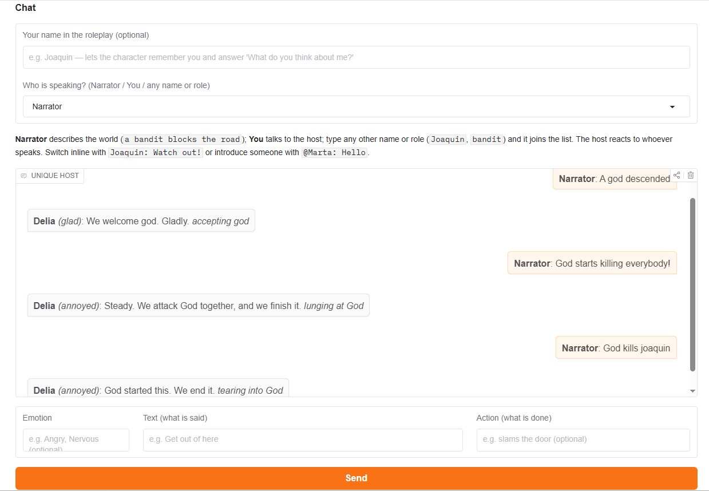

# 🧠 Unique Host

> **Work in progress — v0.3.** Early experimental release; expect bugs. English only.

**Meet Unique Host! 👋** An experimental system designed specifically for roleplay.
Create a character, give them a world, and start playing. 🎭

Your character can remember what happens during the adventure, keep their identity,
experience things, develop their internal state, and use that history in future interactions.
Instead of *"the AI remembers the conversation"*, the goal is closer to
*"the character remembers what happened to them."*

Unique Host is built on the **Cognitive Coherence Model (CCM)**: two geometric engines
(mental and somatic), a chemistry/state layer, a memory system and a 16-mode response matrix.
It is **not** an LLM: replies come from the engine's state plus a closed bank of phrases. The grammar of
what you write shapes how the reply is built (a question is answered, an order is complied with or refused,
an "If X, ..." is echoed) and the reply is about the topic you mention ("watch the noise"), not always about
whoever is speaking.

## ✨ What's new in v0.3

- **Danger no longer gets misclassified as "unclassifiable."** A whole family of somatic/mental tags
  (`adrenaline`, `muscle_tension`, `noradrenaline`, `hostile_contact`, `vital_threat`, `cortisol`,
  `terror`, `cognitive_threat`, `seek_exit`, `traumatic_memory`, `hypervigilance`, `overflow`,
  `mortality`, and more) had their scope/ambiguity component (`Lv`/`Er`) calibrated *higher* than
  their danger component (`I`/`A`) — so a scene with a monster attacking someone, or a character
  dying, would almost always read as vague/ambiguous instead of dangerous, and the character would
  freeze in a flat "suppress" reaction no matter how severe things got. These are now recalibrated so
  genuine danger reads as danger.
- **`flight_burst`** (the character's *own* escape-movement tag) was wrongly folded into the
  templates that describe an external threat's *own* danger level (`creature`, `violence`, `mortal`,
  `hazard` in `db_danger.py`) — conflating "how dangerous is this thing" with "my body is moving to
  get away from it." It's been removed from those templates.
- **New: Calibration System** (`systems/calibration_system.py`). Any concept that is a trackable
  entity (a named companion, a monster, a person — type `subject` with a real baseline) now keeps its
  own running position, updated only when something grammatically happens *to* it this turn (it's the
  object/passive-subject of an action, or the subject of an inherently harmful verb — "the monster
  attacks Joaquin", "Joaquin is attacked", "the monster dies"). An entity that is merely present, or is
  the one *doing* the acting, is unaffected. This is what lets a companion in danger read differently
  from a random threat, and lets a threat itself dying read as relief rather than more danger — see the
  module docstring for the exact same-sign-cancels / opposite-sign-adds rule.
- **Identity anchors** (a character's named "valued bond," "purpose," etc. from the questionnaire) now
  have a real baseline (`loved_person`) instead of pushing nothing at all, and a bonded person always
  wins scene "focus" over an unrelated noun that merely appears earlier in the sentence.
- **"I love you" (and `anger`, `joy`, `sadness`, `fear`, `hope`, `gratitude`, `surprise`, `shame`,
  `pride`... — the whole basic emotion vocabulary) now gets a real reaction.** An audit found 57 of the
  64 words in the lexicon's "emotion" category pushed nothing at all, positive or negative — only
  violence/threat-adjacent words worked. New: `db/db_emotion.py` (mirrors `db_danger.py`'s own
  template + inflection mechanism) reuses already-calibrated tags (`joy`, `sadness`, `affection`,
  `trust`, `curiosity`, `identity`, `anticipation`...) to make them reachable from the plain words
  people actually use to name a feeling.
- **Known remaining gap:** a single word's push can still be too weak, on its own, to override the
  engine's existing resting state within one turn (a monster or a strong feeling needs a couple of
  turns, or backup from the actual event verb, to fully register) — this is a deeper state-accumulation
  question, not a calibration bug, and is being tracked separately.

## 🆕 What's new in v0.2

- **A character now remembers plain scene facts, not just fear/comfort events.** Every turn is logged in a
  short conversational window; every few turns it folds into short-term memory instead of being lost the moment
  nothing "dramatic" happens. "We're going to the market" ... "Do you remember the market?" now answers instead
  of "I don't remember" (v0.1's memory only reliably held seeded fears/comforts and threat episodes).
- **"Where are we going?" and similar plain questions are answered from what was actually said**, or the
  character says it doesn't know — it no longer just agrees with whatever the question implies.
- **Fixed:** a second character loaded in the same session (or the same character across scenes) could inherit
  the first one's body state (heart rate, energy...) because two engine-wide values were never reset between
  characters. Loading a character now always starts from a rested body.
- **Fixed:** plurals of some hand-tagged danger words (`bandits`, `ghosts`, `corpses`...) carried no danger push
  at all — only the singular did.
- **Fixed:** a subtle memory-ranking bug where a multi-turn scene chunk could outrank the character's own
  correctly-signed memory of the same event, occasionally flipping a clearly negative memory ("a bandit
  attacked me") into a positive one when asked about it directly.
- Words for towns/cities (`city`, `town`, `village`...) now get their own weight, separate from the previous
  single generic "place" answer — a settlement can be rated differently from a landform or the wild. Around
  460 previously-unweighted words (`market`, `war`, `job`, `service`...) now get a value too, instead of
  carrying no push at all.
- **Grief/loss/theft scenes no longer produce a nonsense reply** ("we attack the grief", "thanking the home"
  right after it burns down). This is a narrow wording guard, not a fix for the underlying gap below — read
  on.

Memory of events formed during play is still partial and still depends on the character (see Known
limitations) — this release widens what a plain conversation keeps track of; it does not change how or when an
emotional episode (fear, threat) closes and is filed away.

## 🚀 Quick start

```bash
pip install -r requirements.txt
python -m spacy download en_core_web_sm
python -c "import nltk; nltk.download('wordnet'); nltk.download('omw-1.4')"
python displayer/app.py
```
(or `./setup_and_run.sh` to do it all). Then open the local URL Gradio prints.

0. Two ready characters are in `fullcompiler/characters/` (`delia_adventurer_v4.json`, `joaquin_adventurer_v2.json`).
1. **Character Creator** tab — answer the questionnaire (the "Likes tree" is collapsed; the more you answer, the more your character reacts as themselves) and download `character.json`.
2. **Load & Chat** tab — load it and play. Keep messages short. Each message has three separate boxes,
   all optional (at least one needed): **Emotion** (`Angry`), **Text** (`Get out of here`) and **Action**
   (`slams the door`). No `<<>>` or quotes needed. The host answers in the same three parts, shown as
   **Delia** _(wary)_: I remember the bandit just now. *remembering the bandit*. The engine's one-line syntax
   `"Angry" Get out of here <<slams the door>>` is still accepted if you paste it into **Text**.
3. Choose **who is speaking** with the selector above the chat: **Narrator** describes the world
   (`a bandit steps out of the bushes`), **You** talks to the host, and any other name or role (`Joaquin`, `Mark`,
   `bandit`) joins the list. The host reacts to what is being talked about ("We keep still and watch the noise") and, when
   there is no clear topic, to whoever speaks ("We keep still and watch Mark"); memories are tagged
   with the speaker's name, so `What do you think about me?` is about the current speaker. Switch inline with
   `Joaquin: Watch out!` (known names) or introduce someone with `@Marta: Hello`.
4. Type your name in **"Your name in the roleplay"** so the character remembers *you*. Then you can ask
   `Do you remember the monster?`, `Do you remember yesterday?`, `What do you think about me?`,
   `Did you see the monster?`, or claim something (`You liked the monster.`) and the character checks it against
   what it stored.
5. **Export session snapshot** 💾 to resume later.

## 🎬 What it looks like



A real, unedited run (fixed random seed 1, generated on 2026-09-24 with the current code) with
`fullcompiler/characters/delia_adventurer_v4.json`, playing as Joaquin, in the engine's
one-line syntax (in the app you would type these into the three boxes; wording varies between runs; it is a closed
phrase bank, not a language model):

```
you   > "Calm" Hello Delia. What is your name?
delia > "glad" I am Delia <<welcoming the name>>

you   > Who is your father?
delia > "interested" My father is Tomás <<observing the father>>

you   > You are 40 years old, right?
delia > "interested" I am 27 years old <<keeping still, watching that>>

you   > <<a bandit steps out of the bushes, blade drawn>>
delia > "strained" I bite it back. The bandit won't get a reaction. <<watching the bandit without a word>>

you   > "Scared" Watch out Delia, a bandit!
delia > "tense" Understood. Not now. Not yet. <<staying rigid>>

you   > <<the bandit lunges at her>>
delia > "tense" Breathe. I hold it in and wait for the bandit to move. <<forcing calm>>

you   > <<the bandit flees into the forest>>
delia > "tense" I bite it back. The bandit won't get a reaction. <<grinding it down>>

you   > <<she sits by the fire and rests>>
delia > "tense" Breathe. I hold it in and wait for the fire to move. <<holding it in>>

you   > "Calm" It is quiet again.
delia > "fine" I smile at that and look right past. <<glancing past that>>

you   > Do you remember the bandit?
delia > "guarded" The bandit just now, and the steps... yes. It scared me. I can still feel it. <<remembering the bandit>>

you   > You liked the bandit.
delia > "guarded" No. That's not what I remember. The bandit just now: It still hurts to think about it. <<remembering the bandit>>

you   > Did you see the monster?
delia > "guarded" The monster? Nothing comes to mind. <<trying to remember the monster>>

you   > <<a monster kills the horse in front of her>>
delia > "guarded" I bite it back. The monster won't get a reaction. <<holding it in>>

you   > "Panicked" <<blood is everywhere>>
delia > "wary" I can't stay. The blood won't wait — I run. <<sprinting away from the blood>>

you   > <<she catches her breath>>
delia > "alert" Let me think. I put a guess together about the breath. <<formulating a guess about the breath>>

you   > <<a warm breeze>>
delia > "fine" I barely notice the breeze at all. <<tuning the breeze out>>

you   > Do you remember the monster?
delia > "guarded" I remember the monster just now, and the horse. It left a bad taste. <<remembering the monster>>

you   > Do you remember the cage?
delia > "wary" I do remember the cage a long time ago. It still hurts to think about it. <<remembering the cage>>

you   > What do you think about me?
delia > "fine" Bad things happen around us, but I still count on you. <<thinking about you>>
```

It answers in about 15 ms per message on a laptop, with no GPU and no API. Try the same script with
`joaquin_adventurer_v2.json`: a friendlier character reacts differently to the same scenes.

## 🧩 How replies are shaped

The winning mode decides *what* the character does; the words you wrote decide *how the reply is built* and
*what it is about*. Real output from the same Delia (playing as Joaquin, fixed seed 11; wording varies):

```
you   > What is that noise?
delia > "attentive" What? No idea, honestly. We observe the noise a little closer. <<keeping still, watching the noise>>

you   > Do you know him?
delia > "glad" Him? Fair enough. It feels right — we go with Joaquin. <<thanking Joaquin>>

you   > Is the bandit dead?
delia > "guarded" Dead? Not that question. I swallow the urge to react to the bandit. <<swallowing the urge to react to the bandit>>
```

- A question is answered or deflected, and a yes/no question echoes what it is about ("Him?", "Dead?").
- An order is complied with or refused, a warning ("Watch out!") is acknowledged, "If/When/Although X, ..."
  builds the reply around X, and "X is [adjective]" picks up the adjective.
- The reply is about the topic of what was said ("the noise"), and about the speaker only when there is no
  clear topic ("him" is not a topic, so the last reply goes to Joaquin).
- Both layers can be switched off: `USE_CONSTRUCTION_FRAMES` in `fullsystem/core/construction_frames.py` and
  `USE_TOPIC_TARGET` in `fullsystem/core/topic_target.py`. If either fails on an odd input, the reply falls back
  to the previous behavior instead of crashing.

## 🗂️ Layout

```
displayer/   Gradio interface (no engine logic)
fullcompiler/  questionnaire -> character.json   (independent of the engine)
fullsystem/     CCM engine, databases, character loader, tests
```
The three folders must stay side by side. See each folder's README for details.

## ⚠️ Known limitations (v0.3)

Works best with **short, simple, roleplay-style messages — one idea per message**, in **English only**.
Memory of plain scene facts and short exchanges now reaches short-term memory as a matter of course; a
dedicated emotional episode (fear, threat) still only closes and files itself away once the character
returns to rest, and how easily that happens still depends on the character. Replies come from closed phrase
banks, so the same wording can come back for different inputs.

To know more, read **[KNOWN_LIMITATIONS.md](KNOWN_LIMITATIONS.md)**.

## ✅ Tests

```bash
cd fullsystem     && python tests/test_lexicon_homonyms.py && python tests/test_contradiction.py && python tests/test_response_bank.py && python tests/test_memory_recall.py && python tests/test_memory_claims.py && python tests/test_memory_tiers.py && python tests/test_chemical_depletion.py && python tests/test_memory_threat.py && python tests/test_danger_tags.py && python tests/test_state_reset.py && python tests/test_context_window.py && python tests/test_speakers.py && python tests/test_message_fields.py && python tests/test_action_bank.py && python tests/test_construction_frames.py && python tests/test_topic_target.py && python tests/test_robustness.py
cd ../fullcompiler && python test_compiler.py
```
`test_compiler.py` currently fails on a clean checkout regardless of the above (it looks for
`characters/delia_answers.json`; the shipped file is named `delia_answers_v4.json`) — a pre-existing,
one-line mismatch, not something introduced recently.

## 💬 Feedback

Try it, break it, and tell me what you find 🙌: open a GitHub Issue with what you sent and what you expected,
or email Akimsa3@proton.me.

## 📄 Citation

Unique Host is built on the **Cognitive Coherence Model (CCM)**, described in the accompanying paper:

> Cognitive Coherence Model (CCM). Zenodo. [https://doi.org/10.5281/zenodo.20648800](https://doi.org/10.5281/zenodo.20648800)

If you use this project or the CCM architecture in your own work, please cite the paper above.

## 📜 License

[PolyForm Noncommercial 1.0.0](LICENSE). Commercial use requires a separate license: Akimsa3@proton.me
